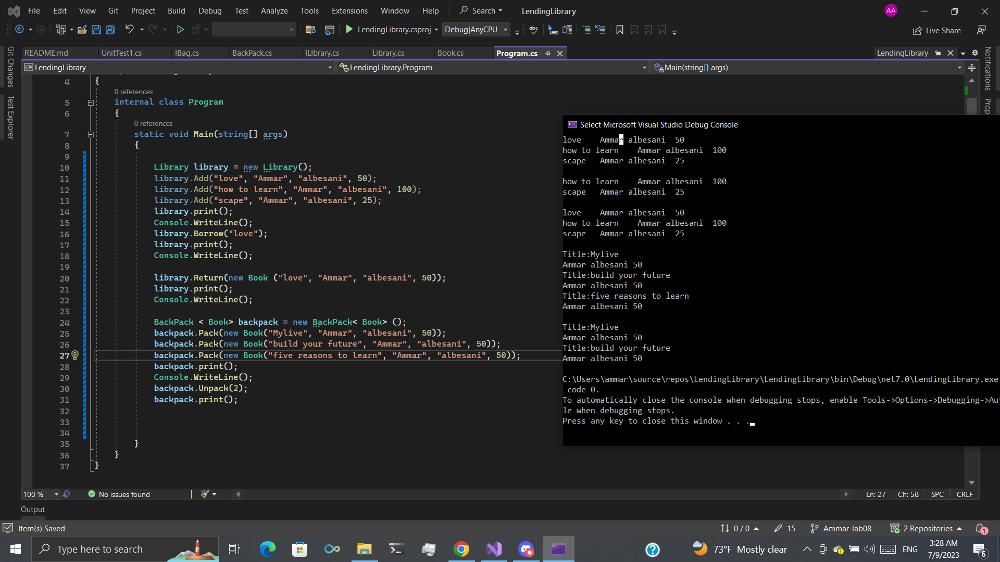

## LedningLibrary
The project consists of two classes: Library and Backpack, and their respective interfaces ILibrary and IBag. These classes allow you to create a library system for managing books and a generic backpack for storing any item.

The Library class implements the ILibrary interface, which extends the IReadOnlyCollection interface. It provides methods for adding books to the library, borrowing books by title, and returning books to the library. The library internally uses a private Dictionary<string, Book> to store books, using the title as a key for quick access.

The Book class represents a book entity with properties such as Title, Author, and NumberOfPages. It provides a constructor to initialize these properties.

The Backpack class implements the IBag interface, which allows you to add elements of any type T to the backpack and remove elements by index. It internally uses a private list to store items.

## visualisation

## How to use 
Create a new instance of the Library class:

~~~b
Library library = new Library();
~~~

Add books to the library using the Add method:
~~~b
 library.Add("love", "Ammar", "albesani", 50);
~~~

Print book using print method:

~~~b
 library.print();
~~~

Borrow a book from the library:

~~~b
 library.Borrow("love");
~~~

Return a book from to library:

~~~b
 library.Return(new Book ("love", "Ammar", "albesani", 50));
~~~

Create a new instance of the Backpack<Book> class:

~~~b
 BackPack < Book> backpack = new BackPack< Book> ();
~~~

Pack a book to backpack:

~~~b
 backpack.Pack(new Book("Mylive", "Ammar", "albesani", 50));
~~~

unPack a book from backpack:

~~~b
  backpack.Unpack(2);
~~~

## More information

Using these classes, you can create a library system to handle books and a backpack to store any kind of items. The Library class uses a dictionary to efficiently store and retrieve books by title, while the Backpack<T> class uses a list for item storage.

